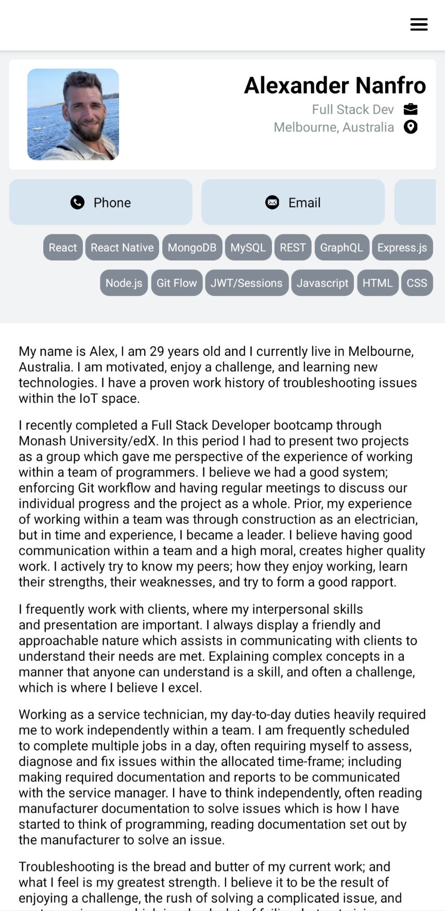

# Nativo

## Description

You want to see my portfolio, but you hate websites. That's okay... there's an app for that.

## Table of Contents

1. [Developer Comments](#developer-comments)
2. [Deployed Application](#deployed-application)
3. [License](#license)
4. [Contribution](#contribution)
5. [Attributions](#attributions)
6. [Questions](#questions)

## Developer Comments

First impressions of React Native was of how simple it was to transition from React to building an app with React Native and Expo.  I first wanted to build something small, simple and achievable, and just focus on learning React Native so I can build something larger with a backend.  This project is an app version of my React portfolio project '[xandinho](https://github.com/x4ndez/xandinho)'.  Simply, it pulls my GitHub repositories and forms a list with the data collected from the API request.  Happy to say I'm excited to build my next app!

## Deployed Application

A video walkthrough is available at the following link: <https://youtu.be/3nx1aUY-Gbc>.

Alternatively, you can install the app directly onto your Android device by downloading and installing the .apk file.
Download the .apk by clicking [here](https://expo.dev//accounts/x4ndez/projects/nativo/builds/899b897e-a37b-4bd4-a75b-ccc6281d276b) or by scanning the QR code below and clicking install.

A note on installing this app on Android

- On devices running Android 8.0 (API level 26) and higher, you must navigate to the Install unknown apps system settings screen to enable app installations from a particular location (i.e. the web browser you are downloading the app from).

- On devices running Android 7.1.1 (API level 25) and lower, you should enable the Unknown sources system setting, found in Settings > Security on your device.

## License

 
This project is covered under the MIT License and is not for commercial use. It is for personal use only.

## Contribution

x4ndez: <https://github.com/x4ndez>

## Attributions

Flaticon attributions in compliance with [Flaticon-supplied guidelines](https://support.flaticon.com/s/article/Attribution-How-when-and-where-FI?language=en_US&_ga=2.76949014.2084137386.1701556714-959030861.1701556714&_gl=1*l8igym*fp_ga*OTU5MDMwODYxLjE3MDE1NTY3MTQ.*fp_ga_1ZY8468CQB*MTcwMTU2MjEyNC4zLjEuMTcwMTU2MjM1MS42MC4wLjA.*test_ga*OTU5MDMwODYxLjE3MDE1NTY3MTQ.*test_ga_523JXC6VL7*MTcwMTU2MjEyNC4zLjEuMTcwMTU2MjM1MS41OC4wLjA.)

- [LinkedIn/GitHub icons located in header of home page created by Uniconlabs - Flaticon](https://www.flaticon.com/free-icons/website) 
- [Phone icon located in header of home page created by Uniconlabs - Flaticon](https://www.flaticon.com/free-icons/email) 
- [Job Title icon located in header of home page created by Pixel perfect - Flaticon](https://www.flaticon.com/free-icons/work) 
- [Location icon located in header of home page created by hqrloveq - Flaticon](https://www.flaticon.com/free-icons/address-location) 
- [Phone icon located in header of home page created by Creaticca Creative Agency - Flaticon](https://www.flaticon.com/free-icons/phone) 
- [Navigation icon located in Navigation created by Andy Horvath - Flaticon](https://www.flaticon.com/free-icons/navigation) 
- [Loading icon located while loading in Portfolio created by Freepik - Flaticon](https://www.flaticon.com/free-icons/loading) 

## Questions

Questions may be directed to my LinkedIn: <https://www.linkedin.com/in/alexandernanfro/>.
